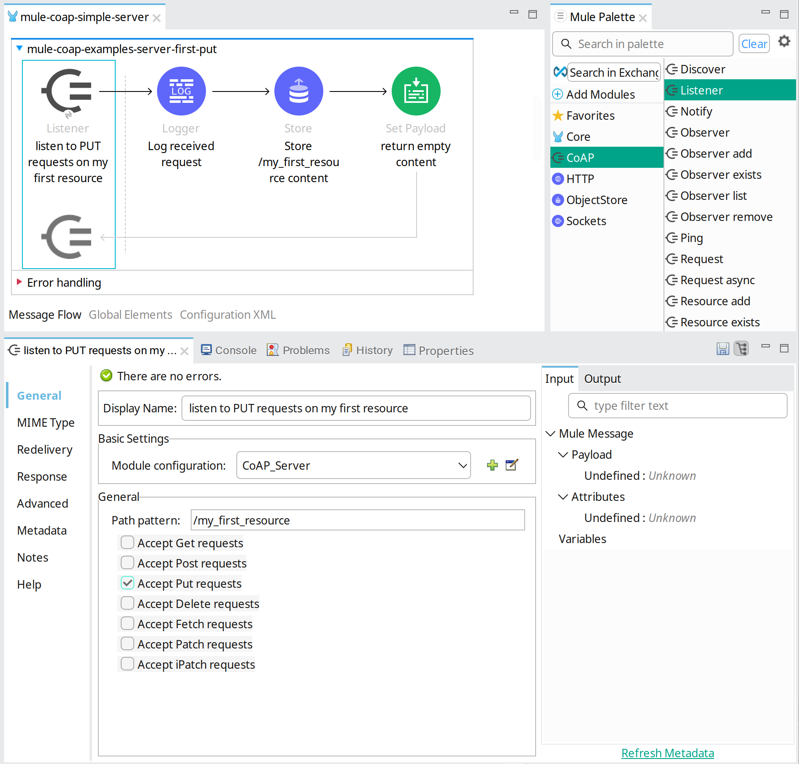

# Mule CoAP Connector


Mule CoAP Connector is a [Mule](https://www.mulesoft.com/) extension that enables Mule 4 applications to implement IoT services and/or IoT clients that make use of the CoAP protocol. 

The CoAP protocol is specified by [RFC7252 - Constrained Application Protocol](http://tools.ietf.org/html/rfc7252) and other specifications (see below). 
The connector uses Californium, a Java CoAP implementation. More information about Californium and CoAP can be found at:

* [http://www.eclipse.org/californium/](http://www.eclipse.org/californium/)
* [http://coap.technology/](http://coap.technology/).

The complete Mule CoAP Connector documentation can be found at [Teslanet.nl](http://www.teslanet.nl)

## Supported versions
* Mule 4.3+
* Java 1.8, 11, 17

## The CoAP protocol
The CoAP protocol is an Internet Standard published by [IETF](https://www.ietf.org/) in:

* [IETF rfc 6690](https://www.rfc-editor.org/rfc/rfc6690)
* [IETF rfc 7252](https://www.rfc-editor.org/rfc/rfc7252)
* [IETF rfc 7641](https://www.rfc-editor.org/rfc/rfc7641)
* [IETF rfc 7959](https://www.rfc-editor.org/rfc/rfc7959)
* [IETF rfc 8132 ](https://www.rfc-editor.org/rfc/rfc8132)

and other.

## Uses

* [Californium](https://www.eclipse.org/californium/) 3.14.0

## Installation

To use Mule CoAP Connector in your Mule 4 application, 
add following dependency to your `pom.xml`:

```xml
  
    <dependency>
        <groupId>nl.teslanet.mule.connectors</groupId>
        <artifactId>mule-coap-connector</artifactId>
        <version>3.3.0</version>
        <classifier>mule-plugin</classifier>
    </dependency>
  
```

After updating dependencies in Anypoint Studio, all CoAP tools (message-sources and message-processors) will be shown in the Anypoint Studio panel - _Mule Palette_.

## Reporting Issues

You can report issues and feature requests at [github](https://github.com/teslanet-nl/mule-coap-connector/issues).

## Contact

Questions or remarks? Create an issue on [github](https://github.com/teslanet-nl/mule-coap-connector/issues).

## Contributing

Use issues or pull-requests on your fork.

## Quick start

The CoAP Connector has numerous configuration options to realize the CoAP communication that is needed in your 
specific use case. Sensible default CoAP parameters make it easy to get CoAP clients and servers up and running 
with minimal effort. Below some explanation how to get started in AnypointStudio, after you have installed 
the maven dependency to the _pom.xml_ of your mule application.

### CoAP client requests

CoAP requests such as _GET_ and _PUT_, can be added to your application by dragging the CoAP Request message-processor 
from the AnypointStudios Mule Palette into the application flows, or by editing the application xml configuration directly.


On this request set the host, port and path of the CoAP resource that the request should operate on.
 Optionally query parameters can be added. The different CoAP options to add to the request are configured on the Options Tab. 


Xml configuration:


```

    <coap:request  
        doc:name="PUT eclipseprojects test" 
        type="CONFIRMABLE"
        requestCode="PUT" 
        host="californium.eclipseprojects.io"
        port="5683" 
        path="/test"
        config-ref="CoAP_Client" />

```


### CoAP Client Configuration


The Client Config element is referenced by Requests and other CoAP Message Processors and holds
the default configuration to use. Also it defines the CoAP endpoint to use. 

Multiple client configurations can be created to define different defaults to use on the different requests. 
When defining multiple clients, remember to define a separate CoAP Endpoint that is referenced by 
these client configurations, because the resources overhead resides in the endpoint. Client configurations that reference 
an endpoint configured separately are light-weight.

By default the CoAP endpoint binds to a free random - so called - ephemeral port.


Xml configuration:


```

    <coap:client-config
        name="CoAP_Client_eclipseprojects"
        host="californium.eclipseprojects.io" 
        port="5683"/>

```

### CoAP Server Configuration


The Server Config element configures a CoAP server. The server defines resources and 
makes these available to clients. Which CoAP request-types are allowed is set 
on the resources, as well as the Discovery Information. The Discovery Information can be queried 
by clients using the _./well-known/core_ resource. 
By nesting Resources the resource tree structure of the CoAP Server is formed, on which CoAP requests can be issued 
by clients.


Without explicit endpoint configuration the server listens on a default UDP endpoint, that binds to port 5683.

Alternatively a non-default port number 
and many other CoAP parameters can be set on an explicitly defined endpoint.
When an endpoint is given, remember to at least set the port number, otherwise a 
random port is chosen - which is not what is normally wanted for a server endpoint.


Xml configuration:


```

    <coap:server-config name="CoAP_Server" doc:name="CoAP Server" >
        <coap:endpoint >
            <coap:udp-endpoint >
                <coap:socket-params bindToPort="5683" />
            </coap:udp-endpoint>
        </coap:endpoint>
        <coap:resources >
            <coap:resource 
                resourceName="my_first_resource" 
                get="true" 
                put="true">
                <coap:core-info-config title="The first resource of this server." ct="0" />
            </coap:resource>
            <coap:resource 
                resourceName="my_second_resource" 
                get="true" 
                put="true">
                <coap:core-info-config title="The second resource of this server." ct="0" />
            </coap:resource>
        </coap:resources>
    </coap:server-config>

```


### CoAP Listeners

The server listens on the on the endpoint for client requests. Listeners are configured as 
message sources of Mule flows. The Listeners will hand over incoming requests to the flow.

A listener defines which requests on the server are delivered to the Mule flow, by the setting the resource-path 
on the path-pattern parameter. Requests on resources that comply to this pattern are delivered to the flow. 
Multiple resources can be configures on the path-pattern, using the wildcard symbol "\*".
A listener with the path-pattern "/\*" will deliver requests on all resources. 

Additionally, requests can be selected based on the CoAP request-types that are configured on the Listener.


When the Listener delivers a message to the flow, the CoAP payload, CoAP options and other context of the CoAP request
is made available to the flow as Mule message containing payload and attributes.

On the Response Tab of the listener can be explicitly configured which CoAP response is to return. 
By default, the payload and mime-type of the resulting Mule message of the flow, is used as CoAP response. 
When not set on the Listener an appropriate CoAP Response code is chosen for the CoAP request at hand. 
For instance, a _CONTENT_ response is returned by default on a _GET_ request,
and _CHANGED_ is used on _PUT_ and _POST_ requests. 





Xml configuration:


```

    <coap:listener doc:name="listen to PUT requests on my first resource" 
        config-ref="CoAP_Server" 
        pathPattern="/my_first_resource" 
        put="true">
        <coap:response 
            responseCode="CHANGED" 
            responsePayload="#[null]"/>
    </coap:listener>

```

